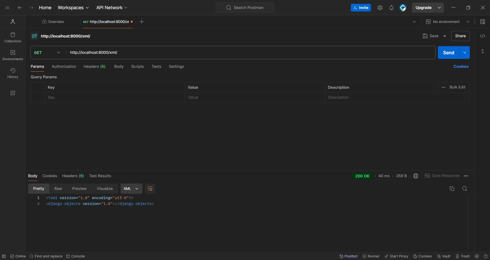
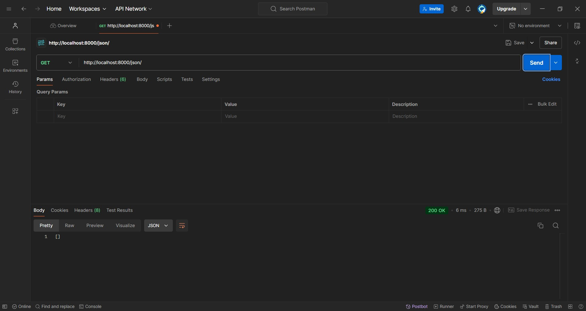
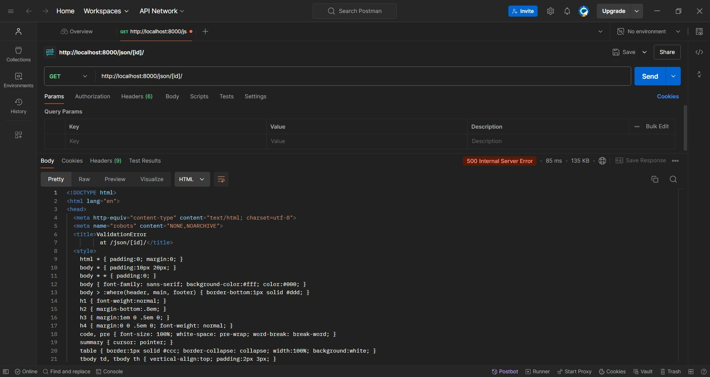

# Tugas 2

### 1. Jelaskan bagaimana cara kamu mengimplementasikan checklist di atas secara step-by-step (bukan hanya sekadar mengikuti tutorial).

**Jawab:**

Buatlah virtual environment terlebih dahulu dengan me-run `python -m venv env` lalu aktifkan virtual environment-nya dengan `env\Scripts\activate`. Tergantung permintaan proyeknya, langkah berikutnya biasanya adalah untuk mengunduh package Django dan dependencies-nya melalui `pip install [options]`. Apabila semua itu sudah berhasil dilakukan, maka bisa membuat proyek Django dengan me-run `django-admin startproject [nama_project]`.

Untuk membuat aplikasi baru dengan nama `main`, cukup run `python manage.py startapp main`. Langkah krusial selanjutnya adalah untuk menambahkan nama aplikasi tersebut ke dalam dictionary `INSTALLED_APPS` yang terletak pada `settings.py` agar aplikasi `main` bisa terdaftar pada proyek Django.

Routing proyek dapat dilakukan dengan "meng-include" nama aplikasi ke dalam dictionary `urlpatterns` pada `urls.py` tingkat proyek. Untuk "meng-include", harus dilakukan `import admin`, `path`, dan `include` masing-masing. Tampilan `urlpatterns` akan berbentuk seperti berikut.
```
urlpatterns = [
    path('admin/', admin.site.urls),
    path('', include('main.urls')),
]
```

Membuat model pada aplikasi `main` cukup mirip dengan membuat constructor untuk sebuah class yang meng-inherit `models.Model`. Atribut yang akan digunakan adalah `name`, `price`, dan `description` dengan tipe data masing-masing. Cara penulisannya terlampir di bawah.
```
class Product(models.Model):
  name = models.CharField(max_length=255)
  price = models.IntegerField()
  description = models.TextField()
```
Belum selesai sampai situ, setelah membuat/merubah model, sewajibnya melakukan model migration dengan `python manage.py makemigrations` diikuti dengan `python manage.py migrate`. Langkah terakhir ini dapat dianalogikan dengan `git commit` dan `git push`, namun untuk model aplikasi.

Singkat saja, fungsi pada `views.py` dapat ditulis seperti berikut.
```
from django.shortcuts import render

def show_main(request):
    context = {
        'app_name': 'THRIFTxYouth',
        'name': 'Abhiseka Susanto',
        'class': 'PBP C'
    }

    return render(request, "main.html", context)
```
Fungsi harus menerima parameter `request` untuk memproses permintaan client, lalu diisi dengan dictionary `context` yang berisi beberapa variabel yang ingin di-pass ke tampilan antarmuka pada template. Tahap terakhirnya adalah me-render permintaan client dengan mem-passing variabel pada `context` ke dalam template `main.html`.

Routing aplikasi tidak jauh beda dengan routing proyek. Cukup dengan membuat berkas `urls.py` pada direktori `main`, lalu isi berkas tersebut dengan dictionary `urlpatterns` yang akhirnya akan merujuk kepada fungsi yang menampilkan antarmuka sesuai keinginan, yang telah terdefinisi pada `views.py`

Untuk melakukan deployment aplikasi ke PWS, tambahkan proyek ke dalam PWS terlebih dahulu. Nantinya, akan diberikan credentials dan link yang akan dibutuhkan untuk mengakses proyek Django yang telah dibuat melalui url deployment PWS` (<username-sso>-<namaproyek>.pbp.cs.ui.ac.id)`. Sebelum melanjutkan ke langkah berikutnya, lakukan 4 mantras of git (pull, add, commit, push) terlebih dahulu untuk mengsinkronkan perubahan ke repository. Kemudian, run `git remote add <link proyek dari PWS>` untuk menghubungkan lokal dengan PWS. Setup terakhir yang perlu dilakukan adalah melakukan push ke PWS dengan mengganti nama branch menjadi `master` dengan `git branch -M master` lalu di push melalui `git push pws master` untuk menampilkan perubahan pada proyek ke url PWS. Setelahnya, hanya perlu mengubah nama branch-nya kembali ke `main` dengan `git branch -M main`. Agar web bisa diakses melalui url yang telah dibuat, perlu ditambahkan `ALLOWED_HOSTS = ["localhost", "127.0.0.1", "<URL deployment PWS kamu>"]` pada `ALLOWED_HOSTS` di `settings.py`. Selamat! Web Django sudah bisa diakses.

---

### 2. Buatlah bagan yang berisi request client ke web aplikasi berbasis Django beserta responnya dan jelaskan pada bagan tersebut kaitan antara urls.py, views.py, models.py, dan berkas html.

**Jawab:**


---

### 3. Jelaskan fungsi git dalam pengembangan perangkat lunak!

**Jawab:**

Git berperan sebagai "manager" kode yang dapat melacak dan menyimpan semua perubahan yang terjadi di dalam file, sehingga mampu untuk balik ke versi sebelum-sebelumnyanya. Git juga memungkinkan kolaborasi antar developer yang serba bisa sehingga menjadi alat yang canggih untuk kerja tim.

---

### 4. Menurut Anda, dari semua framework yang ada, mengapa framework Django dijadikan permulaan pembelajaran pengembangan perangkat lunak?

**Jawab:**

Menurut saya, django cocok untuk beginner utamanya karena Django merupakan framework yang berbasis Python, yang dianggap banyak orang adalah bahasa pemrograman yang paling noob-friendly.

---

### 5. Mengapa model pada Django disebut sebagai ORM?

**Jawab:**

Model Django dapat disebut sebagai Object Relational Mapping karena `models.py` melacak dan menyimpan banyak objek dengan atributnya masing-masing sehingga bekerja mirip seperti Object Oriented Programming, bedanya model-model ini berperan sebagai database yang dapat mengirim datanya ke `views.py` untuk menampilkan hal-hal sesuai keinginan developer.

---

---

# Tugas 3


### 1. Jelaskan mengapa kita memerlukan data delivery dalam pengimplementasian sebuah platform?
**_Jawab:_**
Data delivery penting bagi suatu web platform karena hampir semua aplikasi memerlukan pengiriman dan penerimaan data, seperti jumlah saldo pada e-commerce, login credential suatu aplikasi pelayanan, dan banyak lagi. Dalam sudut pandang user, kita ingin web yang mudah diakses, cepat, responsif, dan optimal tanpa memandang lokasi ataupun gawai yang digunakan. Developer juga harus mampu mendapatkan kepercayaan user pada segi keamanan data karena tak ada yang ingin data pribadinya terekspos ke penyerang-penyerang.

---

### 2. Menurutmu, mana yang lebih baik antara XML dan JSON? Mengapa JSON lebih populer dibandingkan XML?
**_Jawab:_**
Saya pribadi lebih menyukai format JSON karena sintaks-nya yang lebih mudah dibaca, apalagi berangkat dengan pengalaman menggunakan bahasa pemrograman Java. Namun, memang terdapat beberapa fakta yang menyebabkan JSON lebih sering digunakan oleh kalangan programmer daripada XML:
* Dari segi sintaks, memang betul JSON lebih mudah dibaca karena penggunaannya lebih singkat dan tidak memerlukan end-tag.
* Dari segi yang lebih teknis, JSON memungkinkan developer untuk menyimpan apapun dalam suatu array, yang tidak dapat dilakukan pada XML.
* Karena sintaks-nya yang lebih efisien, JSON juga relatif lebih "ringan" daripada XML yang memerlukan struktur kompleks, menyebabkan ukuran file yang lebih besar.
* Salah satu perbedaan terbesarnya terletak di parsing pada kedua representasi data. XML harus di-parse menggunakan XML parser, yang dapat memperlambat dan membuat proses relatif lebih rumit. Sementara itu, parsing di JSON cukup menggunakan function standar JavaScript. Ditambah dengan sintaks dan perbedaan ukuran file-nya, JSON biasanya lebih cepat dan efisien.

---

### 3. Jelaskan fungsi dari method `is_valid()` pada form Django dan mengapa kita membutuhkan method tersebut?
**_Jawab:_**
Seperti namanya, method `is_valid()` mem-validasi suatu form pada aplikasi. Secara singkat, `is_valid()` akan mengecek ketentuan-ketentuan yang di-define pada field suatu form. Misalnya, input pada suatu instansi EmailField(max_length=254) akan divalidasi oleh `is_valid()` untuk mengecek:
* Apakah input tersebut tergolong suatu email?
* Apakah input tersebut melebihi batas maksimal panjang huruf?

Setelah itu, `is_valid()` juga akan _clean_ data, semisal string '2022-07-30' akan dicek formatnya dan diubah menjadi suatu objek datetime.

Method `is_valid()` ini akan me-return suatu value boolean. Apabila True, akan dilanjutkan ke kondisi yang ditentukan, sementara apabila False akan dikirimkan error message ke dictionary .errors

Banyak sekali logika yang digunakan untuk mem-validasi data pada form dan sangatlah tidak praktis dan tidak fleksibel untuk men-define-nya sendiri menggunakan views. Maka dari itu, `is_valid()` sangat krusial untuk kelancaran suatu aplikasi.

---

### 4. Mengapa kita membutuhkan `csrf_token` saat membuat form di Django? Apa yang dapat terjadi jika kita tidak menambahkan `csrf_token` pada form Django? Bagaimana hal tersebut dapat dimanfaatkan oleh penyerang?
**_Jawab:_**
`csrf_token` secara tidak langsung memberikan perlindungan pada aplikasi dengan menjaga para pengguna dengan memberi suatu token random dengan ukuran besar yang juga unik di suatu session agar penyerang tidak dapat mengakses session pengguna sehingga tidak memungkinkan untuk mengambil datanya. Contoh apabila tidak terdapat `csrf_token`:
* Login ke suatu aplikasi bank
* Akan melakukan suatu transfer, memberi request ke (dengan url) `http://www.mybank.com/transfer?to=<SomeAccountnumber>&amount=<SomeAmount>`
* Membuka suatu link berbahaya `www.cute-cat-pictures.org`
* Apabila pengguna masih _logged in_ pada bank tersebut, pemilik link berbahaya tersebut dapat mengirim request `http://www.mybank.com/transfer?to=123456&amount=10000` yang memberikan uang sebesar 10000 ke penyerang.

Dengan `csrf_token`, url akan dilindungi oleh argumen lain (token), semisal `http://www.mybank.com/transfer?to=123456&amount=10000&token=31415926535897932384626433832795028841971` dimana token tersebut random sehingga hampir mustahil penyerang dapat mengaksesnya.

Source : <https://stackoverflow.com/questions/5207160/what-is-a-csrf-token-what-is-its-importance-and-how-does-it-work>

---

### 5. Jelaskan bagaimana cara kamu mengimplementasikan checklist di atas secara step-by-step (bukan hanya sekadar mengikuti tutorial).
**_Jawab:_**
* Untuk membuat input form untuk menambahkan objek model, pertama-tama dan yang paling utama adalah membuat modelnya itu sendiri di dalam `models.py`, yang di tugas ini berupa:
    ```
    class Product(models.Model):
        id = models.UUIDField(primary_key=True, default=uuid.uuid4, editable=False)
        name = models.CharField(max_length=255)
        price = models.IntegerField()
        description = models.TextField()
    ```
    Model bernama `Product` dan memiliki atribut `name`, `price`, dan `description`.

    Model dan atributnya akan di-_pass_ ke `forms.py` seperti berikut:
    ```
    class ProductForm(ModelForm):
        class Meta:
            model = Product
            fields = ["name", "price", "description"]
    ```
    Class `Meta` bertugas untuk memberikan metadata dari form yang dimaksud, model yang digunakan adalah model yang telah dibuat tadi, dan `fields` berisi atribut-atribut dari model tersebut.

* Melihat data dengan format tertentu tanpa filtering dapat dilakukan dengan:
    ```
    def [function_name](request):
        data = [model_name].objects.all()
        return HttpResponse(serializers.serialize("[format_name]", data), content_type="application/[format_name]")
    ```
    Function menerima parameter `request` agar dapat mengirim request ke server. Di dalamnya, diambil semua data objek dari model yang digunakan dan di-_assign_ ke suatu variabel.

    Setelahnya akan diproses oleh HttpResponse yang memberikan response berupa HTTP dengan format [format_name]. 

* Melihat data dengan format tertentu dengan filter by ID:
    ```
    def [function_name](request, id):
        data = [model_name].objects.filter(pk=id)
        return HttpResponse(serializers.serialize("[format_name]", data), content_type="application/[format_name]")
    ```
    Cukup mirip dengan sebelumnya, bedanya hanya ada argumen baru dan tambahkan `.filter(pk=id)` pada data yang disimpan.

* Routing URL untuk fungsi `views.py` memiliki format sebagai berikut:
    ```
    path('[defined_path]', [function_name], name='[just make it the same as function name]'),
    ```
    Apabila menggunakan filtering by ID, maka hanya perlu diubah sedikit menjadi:
    ```
    path('[defined_path]/<str:id>', [function_name], name='[just make it the same as function name]'),
    ```
    Routing seperti ini akan mengirim request apabila `[defined_path]` dikunjungi, lalu memanggil `[function_name]` yang akan menampilkan data yang sesuai berdasarkan format yang digunakan.

---

### _Screenshots_





---

---

# Tugas 4

### 1. Apa perbedaan antara `HttpResponseRedirect()` dan `redirect()`?
**_Jawab:_**
`HttpResponseRedirect()` hanya dapat menerima argumen berupa url pada parameter pertamanya, sedangkan `redirect()` dapat menerima argumen berupa model, view, ataupun url untuk parameter pertamanya.

---

### 2. Jelaskan cara kerja penghubungan model Product dengan User!
**_Jawab:_**
Menghubungkan model dengan model lainnya menggunakan _foreign key_. Dalam basis data, direpresentasikan sebagai sambungan antara dua tabel berbeda yang menunjuk ke _primary key_-nya. Untuk melakukannya, pertama-tama lakukan import User:
```
from django.contrib.auth.models import User
```
Lalu, hubungkan suatu instansi `Product` dengan `User` dengan membuat variabel seperti berikut dalam modelnya.
```
class Product(models.Model):
    user = models.ForeignKey(User, on_delete=models.CASCADE)
    ...
```

---

### 3. Apa perbedaan antara _authentication_ dan _authorization_, apakah yang dilakukan saat pengguna login? Jelaskan bagaimana Django mengimplementasikan kedua konsep tersebut.
**_Jawab:_**
Secara singkat, _authentication_ memverifikasi identitas seorang _user_ (seperti mengecek _username_ dan _password_), sedangkan _authorization_ dilakukan setelah _authentication_ dan berfungsi menentukan apa saja yang boleh diakses oleh seorang _user_ di dalam sebuah sistem. 
* Django meng-_authenticate_ dengan mengecek validitas _username_ dan _password_.
* Setelah selesai autentikasi, Django akan _autherize_ dengan mengecek apakah _user_ memiliki akses untuk melakukan tindakan-tindakan spesifik melalui method `.has_perm()`

---

### 4. Bagaimana Django mengingat pengguna yang telah login? Jelaskan kegunaan lain dari cookies dan apakah semua cookies aman digunakan?
**_Jawab:_**
Caranya adalah dengan _holding state_ menggunakan _session ID_ berupa semacam token akses yang disimpan sebagai cookie pada _browser_. Cookie inilah yang akan menyimpan status login pengguna sehingga Django dapat mengingatnya selama _browsing_.
* Cookies dapat juga digunakan untuk melihat kebiasaan dan preferensi pengguna dalam _browsing_ sehingga _developer_ dapat menyesuaikannya dengan merekomendasikan konten yang relevan.
* Cookies juga dapat mengurangi beban server dengan menyimpan informasi di komputer pengguna, alhasil membuat web lebih cepat dan efisien.

Namun, tidak semua cookies aman digunakan karena sifatnya yang dapat melakukan _tracking_ dan koleksi data. Walaupun tidak sampai level password atau informasi sensitif, data yang dikumpulkan tetap rentan disalahgunakan.

---

### 5. Jelaskan bagaimana cara kamu mengimplementasikan checklist di atas secara step-by-step (bukan hanya sekadar mengikuti tutorial).
**_Jawab:_**
* Fungsi `register` memerlukan import `UserCreationForm` yang akan membuat form registrasi simpel yang berisi input _username_, _password_, konfirmasi _password_ dengan penjaminan keamanan melalui _hashing password_ lalu disimpan dalam database.
    * form.is_valid() digunakan untuk mengecek kebenaran dari tiap input pada field bersangkutan
    * form.save() berfungsi untuk menyimpan data input pada form
    * messages.success() sebagai pesan konfirmasi
    * redirect() yang dikembalikan digunakan untuk pindah ke url login

* Fungsi `login_user` menggunakan _method_ `authenticate()` dan import `AuthenticationForm` yang akan membuat form login simpel dengan validasi dan autentikasi input. Metode-metode yang digunakan cukup mirip dengan fungsi `register`, bedanya terdapat pada:
    * `login(request, user)` digunakan untuk melakukan login
    * Apabila valid, akan di-_request_ session untuk _user_

* Fungsi `logout_user` dibuat singkat dengan menggunakan `logout(request)` yang akan men-_terminate_ sesi pengguna lalu _redirect_ ke url login kembali

* _Last but not least_, setelah membuat fungsi-fungsi tersebut, jangan lupa untuk menambahkan url fungsi ke dalam `urls.py`

---

* Membuat dummy data `Product` untuk dua akun berkaitan dengan soal berikutnya, yakni menghubungkan model dengan `User`. Cara menghubungkan model dengan `User` sudah dijelaskan pada nomor sebelumnya. Untuk membuat akun dan _dummy_ data di lokal, perlu run `python manage.py runserver` terlebih dahulu lalu kunjungi http://localhost:8000/ kemudian ikuti langkah-langkah berikut.
    * Membuat akun cukup _straight forward_, hanya perlu melakukan registrasi melalui halaman login, lalu isi _credentials_ yang diperlukan seperti _username_ dan _password_.
    * Untuk membuat data `Product`, login terlebih dahulu lalu pencet tombol "Add new product". Setelahnya akan muncul halaman baru dengan input nama, harga, dan deskripsi produk. Isi ketiga _field_ tersebut lalu pencet tombol "Add product" untuk meng-_submit_ data yang diinput.

---
---

# Tugas 5

### 1. Jika terdapat beberapa CSS _selector_ untuk suatu elemen HTML, jelaskan urutan prioritas pengambilan CSS _selector_ tersebut!
**_Jawab:_**
Jika bicara tentang hierarki _selector_ CSS, dapat direpresentasikan dengan _specificity value_-nya masing-masing _selector_:
* Inline styles, e.g. `<h1 style="color: pink;">` -- memiliki prioritas _selector_ tertinggi dengan nilai _specificity_ 1000
* ID _selector_, e.g. `#navbar` -- memiliki nilai kekhususan 100 sehingga menempatkannya di posisi kedua tertinggi dalam hierarki _selector_
* Classes, pseudo-classes, attribute _selector_s; e.g. `.test, :hover, [href]` -- tiga _selector_ ini mempunyai kekhususan yang sama dengan nilai _specificity_ 10
* Elements, pseudo-elements; e.g. `h1, ::before` -- menyandang prioritas terendah dari semua _selector_ yang disebutkan dengan nilai kekhususan 1

Perlu dicatat bahwa terdapat pengecualian untuk penggunaan `!important` di _value_ properti. `!important` akan mendahului semua selector, bahkan inline styles.

_Source:_ https://www.w3schools.com/css/css_specificity.asp

---

### 2. Mengapa responsive design menjadi konsep yang penting dalam pengembangan aplikasi web? Berikan contoh aplikasi yang sudah dan belum menerapkan _responsive design_!
**_Jawab:_**
Teknologi semakin canggih dan perangkat pun makin unik. Bagaimana mengakomodasi ukuran tampilan web dengan perangkat-perangkat ini? Konsep _responsive design_ menangkal permasalahan ini dengan menyusun strategi desain sedemikian hingga tampilan web dapat selalu menyesuaikan dengan ukuran perangkat yang digunakan pengguna.

Contoh aplikasi yang sudah menerapkan _responsive design_: **Website PWS**

Contoh aplikasi yang belum menerapkan _responsive design_: **SIAKNG**

---

### 3. Jelaskan perbedaan antara margin, border, dan padding, serta cara untuk mengimplementasikan ketiga hal tersebut!
**_Jawab:_**
* Margin adalah spasi tambahan di luar border suatu konten
* Border terletak di luar padding dan konten, namun masih di dalam margin
* Padding merupakan spasi yang mengelilingi konten secara langsung dan terletak di dalam border

Ilustrasi:


_Courtesy of https://blog.hubspot.com/website/css-margin-vs-padding_

Contoh implementasinya seperti berikut.
```
.element {
  margin: 20px;             /* 20px margin di semua sisi */
  margin-top: 5px           /* 5px margin hanya untuk sisi atas */
                            /* dapat berlaku untuk sisi lainnya */

  /* menganut konsep yang sama */
  border: 2px solid #000;       /* 2px border solid berwarna hitam */
  border-left: 5px dashed red   /* 5px border bergaris putus-putus di kiri*/

  padding: 10px;                /* 10px padding di semua sisi */
  /* etc */
}
```

### 4. Jelaskan konsep flex box dan grid _layout_ beserta kegunaannya!
**_Jawab:_**
Perbedaan utamanya terletak pada _layout_ flexbox yang berbentuk satu dimensi/arah, sementara grid bekerja seperti tabel (memiliki dua dimensi). Walaupun grid terkesan lebih fleksibel, terkadang lebih praktis untuk menggunakan flex.
* Flexbox sangat bagus dalam mengatur perataan tiap elemen sehingga lebih menguntungkan untuk desain-desain simpel, seperti _navbar_.
* CSS Grid lebih baik untuk _layout_ yang menggunakan desain kolom dan baris, seperti _bento box_.

Ilustrasi:


_Courtesy of_ https://blog.nashtechglobal.com/css-grid-vs-flexbox/

---

### 5. Jelaskan bagaimana cara kamu mengimplementasikan checklist di atas secara step-by-step (bukan hanya sekadar mengikuti tutorial)!
**_Jawab:_**

* Menambahkan fungsionalitas _last login_ bermula dari mengembalikan _response_ untuk _cookie_ melalui `response.set_cookie('last_login', str(datetime.datetime.now()))` pada `login_user` jika formnya ditentukan valid, yang akan mengembalikan suatu string berisi _timestamp_ dan dinamakan sebagai 'last_login'.
* Pada `main > view.py > show_main` tambahkan `'last_login': request.COOKIES['last_login']` pada dictionary `context` untuk melakukan _request_ untuk _cookies_ yang telah dibuat sebelumnya agar dapat disimpan dan ditampilkan nanti.
* Pada `main.html` hanya perlu tampilkan informasi _last login_ dengan menulis `{{ last_login }}` pada kodenya.
* Untuk menampilkan detail _user_ yang sedang _logged in_, cukup mengubah key `name` pada dictionary `context` di `main > view.py > show_main` menjadi `request.user.username` yang akan meminta _username_ untuk suatu _user_ tertenu. Lalu, tampilkan saja di `main.html`.